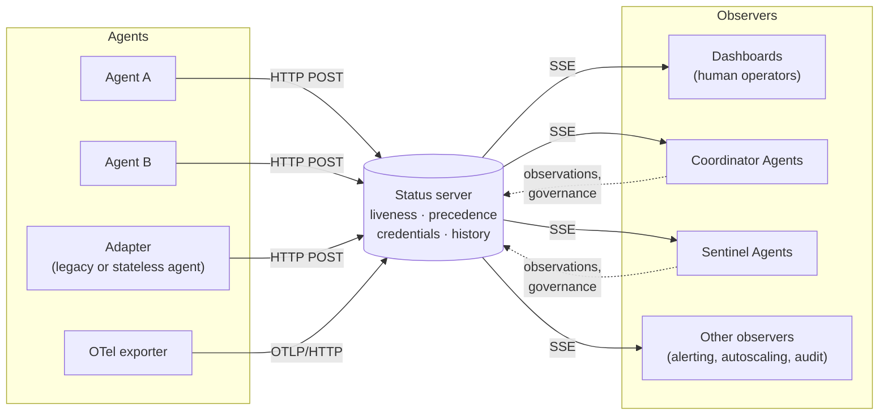

# Agent Status Protocol (ASP)

**A lightweight, protocol-neutral proposal for reporting and observing the state of AI agents in multi-agent systems.**

> **Status: proposal, version 0.1 (working draft).**
> ASP is a proposal submitted for discussion. It has not been reviewed or endorsed by any standards body, and nothing in this repository should be read as an adopted standard. State names, message formats and normative requirements may change substantially in response to feedback. Comments, objections and alternative proposals are welcome: please open an [issue](../../issues) or a pull request.

---

## Why ASP

AI agents are moving from single assistants to systems in which many agents plan, delegate, debate and call tools on each other's behalf. Each agent depends on model providers, tools and budgets that can fail, slow down or run out while the agent is still nominally running. One agent can be watched by hand; a fleet cannot.

Frameworks and protocols expose agent state differently, or not at all, so operators cannot answer basic questions in a uniform way:

- Which agents are alive?
- What is each one doing, and who is waiting on whom?
- Which agent holds the floor in each conversation?
- Which agent should no longer be trusted?

Existing health checks (container probes, gRPC health) answer only *is the process up?*. An agent can be up and ready while its task waits for human approval, while it is rate-limited by its model provider, or while a guardrail has quarantined it. ASP adds these agent-specific dimensions, and reuses what already exists: heartbeats with timeouts, HTTP, Server-Sent Events, A2A task states, OFP floor states and OpenTelemetry GenAI identifiers.

ASP defines the state. It does not define the agent, the framework or the vendor.

## Architecture



- **Agents push** small JSON events over HTTP POST. Agents initiate every connection, so agents behind NAT or firewalls need no inbound ports.
- **The status server** aggregates state, infers liveness from missed heartbeats, enforces the precedence of governance decisions over self-reports, checks credentials and keeps an append-only history.
- **Observers** fetch a snapshot and subscribe to a Server-Sent Events stream. Some observers, such as Coordinator or Sentinel Agents, also report on other agents.

A dedicated server is the *reference* topology, not the only one: the same functions can be embedded in an orchestrator or an OFP convener, built on a message broker such as MQTT, or carried in-band inside the conversation protocol. The more these functions are distributed, the weaker liveness and governance become.

## State model

An agent's state is a tuple of values along five **independent dimensions**, so an agent can be, for example, `busy`, `degraded`, working on a task and waiting for the floor at the same time.

| Dimension | Cardinality | Values |
|---|---|---|
| **lifecycle** | one per agent | `registering`, `initializing`, `online`, `idle`, `busy`, `at-capacity`, `paused`, `draining`, `stopping`, `offline`, `unreachable`*, `crashed` |
| **health** | one per agent | `healthy`, `degraded`, `rate-limited`, `quota-exhausted`, `dependency-down`, `auth-error`, `overloaded`, `unhealthy`, `stalled`* |
| **task** | one per `taskId` | A2A: `submitted`, `working`, `input-required`, `auth-required`, `completed`, `failed`, `canceled`, `rejected`, `unknown` · ASP: `queued`, `awaiting-approval`, `delegated`, `retrying`, `timed-out` |
| **floor** | one per `conversationId` | `not-joined`, `invited`, `joined`, `requesting-floor`, `has-floor`, `yielded`, `floor-revoked`, `left` |
| **governance** | one per agent | `normal`, `sandboxed`, `quarantined`, `policy-violation`, `under-review` |

\* Server-assigned: an agent never reports these about itself.

Conversation roles (such as the OFP `convener`) are not an ASP dimension: they may be carried in the optional `role` field of `floor_change`, with values defined by the conversation protocol.

## Events

Every event is a JSON object with common fields: `aspVersion`, `type`, `agentId`, `eventId`, `seq`, `ts` and, optionally, `source` (`self` by default; `supervisor`, `guardrail`, `operator`, `peer` for reports on other agents).

| Type | Purpose |
|---|---|
| `register` | Sent once, before the agent's first event to a server. Declares `heartbeatIntervalSec` (1–300). |
| `heartbeat` | Periodic liveness signal; may carry `lifecycle`, `health`, `progressSeq`, `activity` and `metrics`. |
| `state_change` | A transition in lifecycle, health, task (with `taskId`) or governance. |
| `floor_change` | A transition in a multi-party conversation (with `conversationId`). |
| `deregister` | Clean shutdown or exit from the deployment. |

```json
{
  "aspVersion": "0.1",
  "type": "state_change",
  "eventId": "7c1e4b0a-2f7d-4d1e-9a51-3b8f6c2d9e10",
  "seq": 42,
  "agentId": "urn:agent:example:research-assistant",
  "dimension": "task",
  "from": "working",
  "to": "input-required",
  "taskId": "t-8812",
  "reason": "clarification-needed: time period",
  "ts": "2026-09-22T17:02:11Z"
}
```

Events carry state, **never** prompts, model outputs, user data or secrets. See [`examples/events`](examples/events) for one example of each type.

## Transport binding (reference)

| Method | Path | Purpose |
|---|---|---|
| `POST` | `/v1/events` | Submit one event |
| `POST` | `/v1/events:batch` | Submit an array of events |
| `POST` | `/v1/traces` | Optional OTLP/HTTP ingest |
| `GET` | `/v1/agents` | Snapshot of all agents |
| `GET` | `/v1/agents/{agentId}` | Snapshot of one agent |
| `GET` | `/v1/stream` | SSE stream of updates (supports `Last-Event-ID`) |

## Liveness and trust

A failed agent cannot be relied on to report its own failure, so ASP does not rely on self-reports alone:

- **Heartbeat timeout.** If no event from the agent arrives within 2.5 declared heartbeat intervals, the server sets `unreachable`.
- **Progress.** An agent whose `progressSeq` stops increasing while a task is `working` or `retrying` is marked `stalled`.
- **Independent observation.** Supervisors, guardrails, operators and peers can report on other agents. Governance decisions by operators and guardrails take precedence over the agent's self-report; peer observations are shown alongside it.
- **Compromised agents.** A quarantined agent cannot clear its own governance state, and its credential can be revoked.

## Relationship to existing standards

ASP complements, rather than replaces, existing protocols:

- **A2A**: task states are reused unchanged; A2A task updates map one-to-one to ASP task transitions.
- **OFP**: floor states and events (`requestFloor`, `grantFloor`, `revokeFloor`, `bye`, …) map to `floor_change`.
- **OpenTelemetry GenAI**: identifiers and metrics reuse the semantic conventions; an ASP server can ingest OTLP spans.

## Repository layout

```
.
├── README.md                     this file
├── CONTRIBUTING.md               how to comment and contribute
├── schemas/
│   └── asp-event.schema.json     non-normative JSON Schema draft for v0.1 events
├── examples/
│   └── events/                   one example JSON file per event type
└── implementations/
    ├── python-status-server/     minimal illustrative status server with a live observer page
    ├── python-agent/             minimal agent that registers, sends heartbeats and task transitions
    └── stateless-adapter/        adapter that reports on behalf of a stateless (serverless-style) agent
```

The implementations are **illustrative sketches**, written with the Python standard library only, to make the proposal concrete. They are not conformance-tested reference implementations and are not intended for production use.

## Quick start

```bash
python3 implementations/python-status-server/server.py
```

Open http://localhost:8080 to watch the live observer page, then in another terminal:

```bash
python3 implementations/python-agent/agent.py
```

`Ctrl+C` stops the agent cleanly with a `deregister`. To see the liveness rules at work, try:

```bash
python3 implementations/python-agent/agent.py --id urn:agent:example:crashy --name Crashy --crash-after 20
python3 implementations/python-agent/agent.py --id urn:agent:example:stuck --name Stuck --stall
python3 implementations/stateless-adapter/adapter.py
```

The first agent exits without deregistering and is marked `unreachable` after 2.5 heartbeat intervals. The second keeps sending heartbeats but makes no progress, and is marked `stalled`. The third shows a stateless agent reported by a persistent adapter.

## Open issues

The draft lists open questions for version 0.2, including a standard credential profile, bindings for topologies without a dedicated server, a registry of governance reason codes, and whether the state vocabulary, event layer and behaviour layer should become separate documents. The list is not exhaustive: challenges to the choices already made are equally welcome.

## Paper

The proposal is described in:

> D. Gosmar, D. A. Dahl, E. Coin, C. Bolyós. *Agent Status Protocol (ASP): A Lightweight Specification for State Reporting in Multi-Agent Systems.* Working draft, 2026. arXiv link to be added.

## License

To be defined by the maintainers before the first release.
